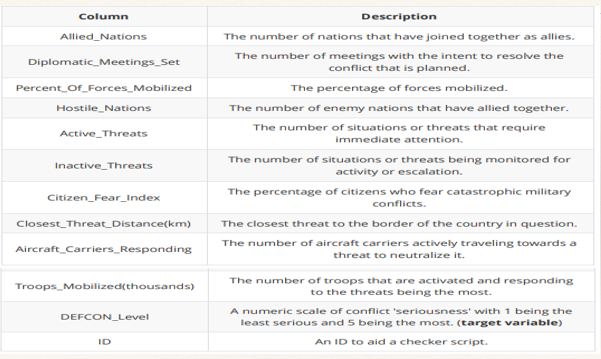
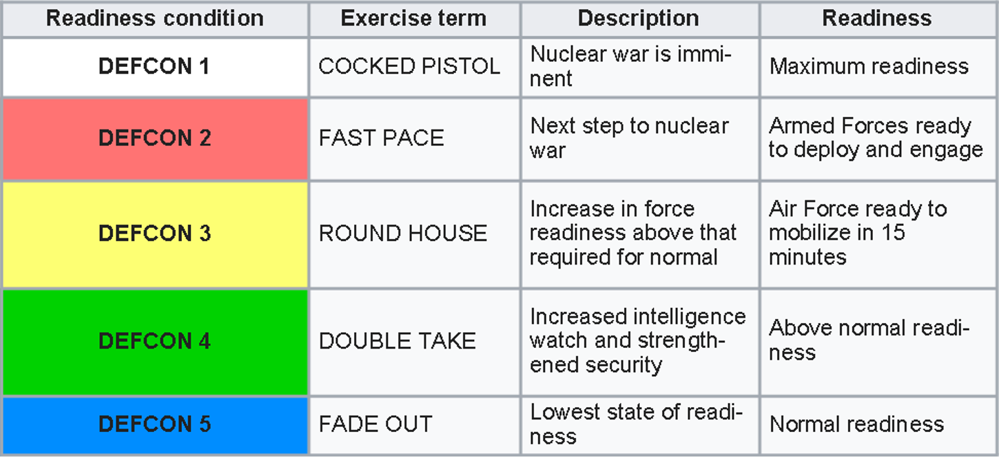
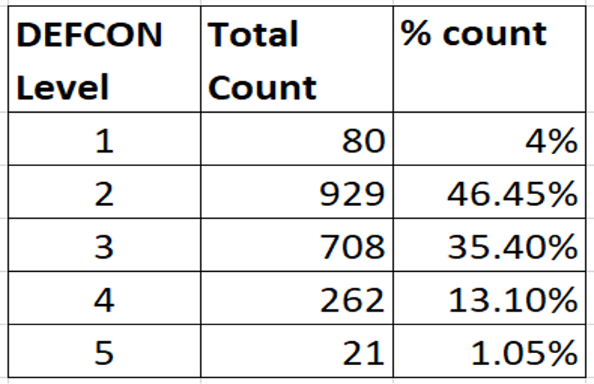

# DEFCON-level-prediction-using-ANN
Use of ANN model for predicting DEFCON level 

# Introduction 

- The goal is to train ANN models based on given dataset and predict the DEFCON level for test data set. 
The first part consists of various visualization and normalization. By visualizing the distribution of features, we can gain some insight how to handle the data and determine the direction of the project.
- The second part is feature engineering. It comprises checking any missing values, encoding , scaling and transformation of features appropriately. 
- The next thing to do is prepare Train, validation and test dataset. 
- Lastly, we will build ANN models, initially simple models and then more complex ones with addition of more hidden layers and neurons. We will try to apply concepts such as dropout, L1/L2 regularization, batch normalization and observe how validation and test accuracy varies for different models.

# Data

- Military conflict is an intense state of violence. In such situations, it is crucial for a nation to stay alert, cope with it, and mitigate its implications. 
A country has set up the DEFCON (Defence Readiness Condition) warning system. This alert system is used to gauge the level of alertness of the defence forces. 
- It consists of five levels of readiness for the military forces to be prepared for the consequences of the conflict. The DEFCON system allows the nation’s forces to be a step ahead of its rivals. 

# Objective

This dataset is intended for multi-class classification tasks. Use this data set to train a model able to classify the different DEFCON levels based on certain conditions.

# Data exploration and pre-processing

- Removed column ‘ID’ from train data set
- Closest_Threat_log and Troops_Mobilized_log features are converted by function np.log
- StandardScaler function applied for all features except predicted one.
- Since DEFCON has multiple classes i.e. 5, we will use to_categorical function to convert integer values into binary matrix. 
- There are 10000 rows in dataset with non NaN values. We will choose 8000 for training dataset, out of which 1600 will be used for validation set. Test set will have 2000 rows.
- We will also normalize data by mean and standard deviation method.

[Jupyter Notebook](./DEFCON.ipynb)

# Prediction of DEFCON level

It can be observed that its level 2 and 3 are contributing most compared to other levels.

